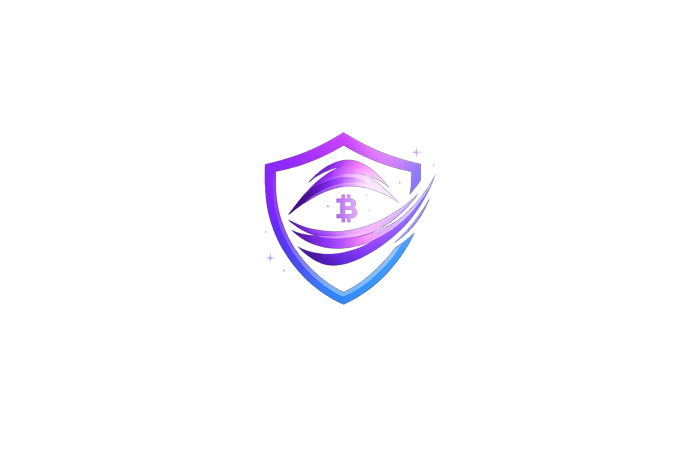

# 🎭 VeilBid

**Privacy-preserving sealed-bid auctions powered by Starknet**

VeilBid is a decentralized auction platform that uses commit-reveal cryptography to ensure complete bid privacy. Built on Starknet, it prevents front-running, bid manipulation, and collusion through cryptographic guarantees.



## ✨ Features

- 🔒 **Sealed-Bid Auctions**: Bids remain cryptographically hidden until reveal phase
- 🛡️ **Front-Running Protection**: No one can see bid amounts before the reveal
- ⚡ **Starknet Powered**: Leverages Starknet's scalable infrastructure
- 🎨 **Modern UI/UX**: Premium glass morphism design with smooth animations
- 🔗 **Wallet Integration**: Seamless connection with Argent X and Braavos wallets
- ⏱️ **Real-time Updates**: Live auction status and countdown timers
- 📱 **Responsive Design**: Works beautifully on desktop and mobile

## 🎯 How It Works

VeilBid implements a three-phase auction mechanism:

### 1. **Commit Phase** 🔐
- Submit a cryptographic commitment of your bid
- Your bid amount is hashed with a secret nonce
- The actual amount remains completely hidden from everyone

### 2. **Reveal Phase** 👁️
- Reveal your bid by providing the original amount and nonce
- The contract verifies it matches your commitment
- Invalid reveals are rejected

### 3. **Settlement** 🏆
- The highest valid bid wins
- Fair, transparent, and cryptographically guaranteed
- Winner receives the auction item

## 🚀 Getting Started

### Prerequisites

- Node.js 18+ and npm/yarn/pnpm
- A Starknet wallet (Argent X or Braavos)
- Testnet STRK tokens (for Sepolia)

### Installation

1. **Clone the repository**
```bash
git clone https://github.com/Demilade01/veilbid.git
cd veilbid
```

2. **Install dependencies**
```bash
npm install
# or
yarn install
# or
pnpm install
```

3. **Set up environment variables**

Create a `.env.local` file in the root directory:

```env
# Contract address on Starknet Sepolia
NEXT_PUBLIC_AUCTION_CONTRACT_ADDRESS=0x00a2d92d7eca591f2bd0ebf2f46571d47adfe24dcf94de9e11ae27cf8a30b24e

# Optional: Custom RPC URL (Alchemy, Infura, or your own node)
NEXT_PUBLIC_STARKNET_RPC_URL=https://starknet-sepolia.g.alchemy.com/starknet/version/rpc/v0_7/YOUR_API_KEY
```

4. **Run the development server**
```bash
npm run dev
# or
yarn dev
# or
pnpm dev
```

5. **Open your browser**

Navigate to [http://localhost:3000](http://localhost:3000)

## 🛠️ Tech Stack

### Frontend
- **Framework**: Next.js 16 with App Router
- **Language**: TypeScript
- **Styling**: TailwindCSS 4
- **Animations**: Framer Motion
- **UI Components**: Custom components with Radix UI primitives
- **Icons**: Lucide React

### Blockchain
- **Network**: Starknet (Sepolia Testnet)
- **Smart Contract**: Cairo
- **Wallet Integration**: starknet-react v5
- **RPC Provider**: Alchemy (optional, falls back to public provider)

### Design System
- Glass morphism effects
- Gradient backgrounds
- Smooth animations and transitions
- Responsive layouts
- Dark mode optimized

## 📁 Project Structure

```
veilbid/
├── app/                          # Next.js app router pages
│   ├── page.tsx                  # Landing page
│   ├── auctions/                 # Auction pages
│   └── layout.tsx                # Root layout
├── components/
│   ├── features/                 # Feature-specific components
│   │   └── auctions/             # Auction-related components
│   │       ├── auction-status.tsx
│   │       ├── bid-form.tsx
│   │       └── create-auction-form.tsx
│   ├── layout/                   # Layout components
│   │   ├── header.tsx
│   │   └── wallet-button.tsx
│   ├── providers/                # Context providers
│   │   └── starknet-provider.tsx
│   └── ui/                       # Reusable UI components
│       ├── glass-card.tsx
│       ├── glow-button.tsx
│       ├── status-badge.tsx
│       └── countdown-timer.tsx
├── contracts/                    # Cairo smart contracts
│   └── src/
│       └── lib.cairo             # VeilBid auction contract
├── hooks/                        # Custom React hooks
│   └── use-auction-contract.ts
├── lib/                          # Utilities and configs
│   ├── contracts/                # Contract ABIs
│   ├── crypto.ts                 # Cryptographic utilities
│   └── constants.ts              # App constants
└── public/                       # Static assets
```

## 🎨 Key Components

### Wallet Connection
- `WalletButton`: Handles wallet connection with dropdown UI
- `StarknetProvider`: Configures Starknet React context
- Supports Argent X and Braavos wallets
- Auto-reconnect functionality

### Auction Management
- `AuctionStatus`: Displays current auction phase and details
- `CreateAuctionForm`: Form to create new auctions
- `BidForm`: Submit and reveal bids with nonce management

### UI Components
- `GlassCard`: Glass morphism card component
- `GlowButton`: Animated button with glow effects
- `StatusBadge`: Phase indicator badges
- `CountdownTimer`: Real-time countdown display

## 🔐 Smart Contract

The VeilBid contract is written in Cairo and deployed on Starknet Sepolia:

**Contract Address**: `0x00a2d92d7eca591f2bd0ebf2f46571d47adfe24dcf94de9e11ae27cf8a30b24e`

### Key Functions

- `create_auction(commit_end, reveal_end)`: Initialize a new auction
- `commit_bid(commitment)`: Submit a bid commitment
- `reveal_bid(bid_amount, nonce)`: Reveal your bid
- `settle()`: Finalize auction and determine winner

### Security Features

- Commitment verification using keccak256 hashing
- Phase transition enforcement
- Duplicate commitment prevention
- Cryptographic bid validation

## 🧪 Testing

```bash
# Run linter
npm run lint

# Build for production
npm run build

# Run production build
npm start
```

## 📝 Environment Variables

| Variable | Required | Description |
|----------|----------|-------------|
| `NEXT_PUBLIC_AUCTION_CONTRACT_ADDRESS` | Yes | Deployed auction contract address |
| `NEXT_PUBLIC_STARKNET_RPC_URL` | No | Custom RPC endpoint (Alchemy/Infura) |

## 🤝 Contributing

Contributions are welcome! Please feel free to submit a Pull Request.

1. Fork the repository
2. Create your feature branch (`git checkout -b feature/amazing-feature`)
3. Commit your changes (`git commit -m 'Add some amazing feature'`)
4. Push to the branch (`git push origin feature/amazing-feature`)
5. Open a Pull Request

## 📄 License

This project is licensed under the MIT License - see the [LICENSE](LICENSE) file for details.

## 🙏 Acknowledgments

- Built with [starknet-react](https://github.com/apibara/starknet-react)
- UI inspired by Web3 design patterns
- Cryptographic primitives from Cairo standard library

## 🔗 Links

- **Website**: [veilbid.vercel.app](https://veilbid.vercel.app) (coming soon)
- **Documentation**: [docs.veilbid.xyz](https://docs.veilbid.xyz) (coming soon)
- **Contract Explorer**: [View on Starkscan](https://sepolia.starkscan.co/contract/0x00a2d92d7eca591f2bd0ebf2f46571d47adfe24dcf94de9e11ae27cf8a30b24e)

## 📧 Contact

For questions or support, reach out via:
- GitHub Issues
- Twitter: [@veilbid](https://twitter.com/veilbid) (coming soon)

---

**Built with ❤️ on Starknet**
